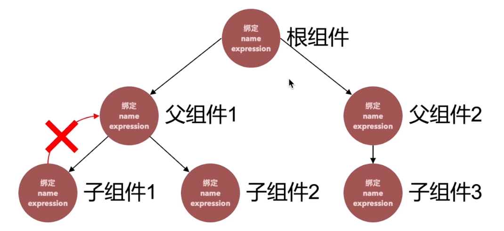
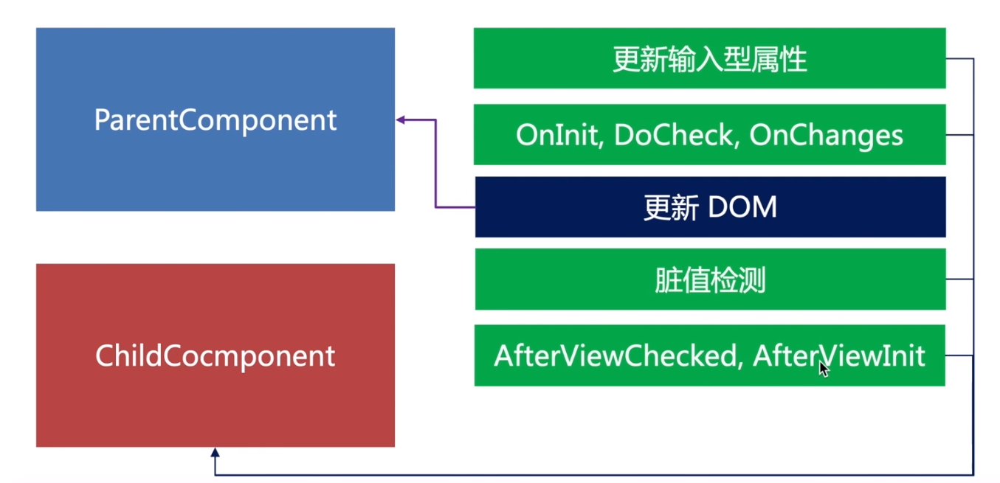

# 脏值检测

## 用一句话概述
当数据模型Model改变的时候更新视图  
触发脏值检测： 事件、setTimeOut、http请求、promise()等异步函数    
针对这样的一个视图对象，angular会建立一个字典对象：
  

{{textContent1}}

……
{
    name:'textContent',
    expression: title
},
{
    name: textConent_1,
    expression: textContent_1
}
……
最终形成的单向树状结构：

  

  
先进行一次整棵树的脏值检测，然后马上检测值是否发生了变化，同时在编程中不要把值的变化卸载afterviewchecked和afterviewinit两个方法中，会触发死循环
优化的方式:
（1）组件使用onpush策略（组件会只观察input的内容变化，并且只跑此分支的树形结构）    
（2）子组件的输入和状态的改变完全依赖父组件，自己变成一个笨组件，完全听父组件的命令，仅负责页面的展示  
angular框架通过自身的checkandupdateview、checkandupdateBinding方法，逐一进行组件的检测  
（3）如果input没有发生变化，通过markforcheck通知脏值检测

## 原理
ApplicationRef监听NgZone的onTurnDone事件产生，然后执行脏值监测

Zone最著名的一个标签就是猴子补丁（Monkey-patched Hooks），用一句话概括就是将所有javascript的原生方法特别是关于异步的重新实现一遍，既然是自己重建那当然可以夹杂一些私货在里面了（比如监控异步函数的执行）。

这些重写的方法包括但不仅限于以下：
window.addEventListener = Zone.addEventListener，
window.removeEventListener = Zone.removeEventListener，
window.setTimeout = Zone.setTimeout，
window.setInterval = Zone.setInterval

除了重写了一些异步方法，Zone还定义了自己的event，当Angular的绑定属性改变，将会触发这些event，其中最关键的event叫onTurnDone。而这个event的handler就是做Change Detection。

## 使用
ngzone获取到浏览器运行angular的js运行池，将值放在ngzone之外并且使用异步的操作，即可绕过脏值检测runoutsideangular()
## 引申
