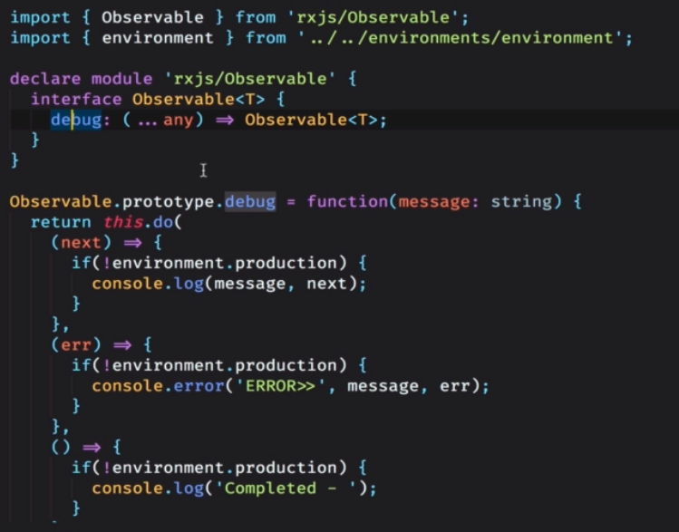

# rxjs

## 用一句话概述
- 为什么使用rxjs，rxjs和promise、async的区别：
（1）rxjs可以持续的监听和相应
（2）丰富的操作符，整洁的代码

- 响应式编程类库，响应式：随着流中的元素的变化做出相应的动作  
- 将一切转换成流，而且和时间维度相关联  
- 流的种类（无限、有限、单独、空）
- 流（observable）的状态（next、error、complete）
```
interval$.subscribe(
    val => {
        console.dir(val);
    },
    err => {
        console.dir(err)
    },
    () => {
        console.dir('complete')
    }
)
```
- obersable的冷处理（类似直播）和热处理（类似点播， shared()）

写法一
html事件转换成流 fromEvent().subscribe()   
.pipe(filter().map())  

写法二
省去subscribe和unsubscribe的语法糖
在html页面中 (selectedTabLink$ | async)去使用   
声明变量： selectedTabLink$ : observable<?>   
在构造函数中：this.selectedTabLink$ = .pipe(filter().map())  


takeWhile() 条件为假的时候，结束流
## 原理

## 实现
第一阶段：
const height$ = Rx.observable.fromEvent(`dom`,"keyup");
height$.subscribe()

## 使用
创建类,转化为obervable
- from 将数组、promise以及iterable转化为一个可以observable的流
- fromEvent 事件转换成Observable
- of 接受一系列数据（数组、数字、对象等），并把他们emit出去
- interval
- time(100, 199) 100毫秒后启动，之后要以199setInterval
转化（取值）
- map 延伸： .map(res => res.json() as ？) 可以用于将http返回的值强制转换为某一类型
- mapTo 转换为一个常量流
- pluck("target", "value") 取一个对象的key值
变换类
- scan 用于记录之前的运行结果，并不只针对于数学运算
- reduce 将流的最终计算的结果运行出来，并不只针对于数学运算
过滤类
- filter
- take
- takeWhile
- first/last
- skip
- debounce(()=> Rx.observable.interval(300)) 动态节流
- debounceTime(300) 300毫秒之内的变化不理会
- distinct 重复的要替换掉 <font color='red'>注意到无尽流的情况</font>
- distinctUntilChanged 只要和前一个元素相同，就要替换掉

流的合并
- combineLatest() 两个流只要有一个发生变化，就重新计算
- zip() 必须两个值都发生变化，重新计算
- merge 流的合并
- concat 流的对接
- startWith([1,2,3]) 向流的头部插入一段内容
- withlatestfrom(other$) 当other$发生变化的时候，变化自身
- flatMap/mergeMap 将多个流拍扁并合并到一个流中，适用于流中有流的情况
```
fromEvent().pluck().flatMap(_ => Rx.Obervable.interval())
.subscribe(val => console.dir(val))
```
- switchMap 当子流发生变化的时候，会重启一个新的流，抛弃掉原有的子流
- subject 
- replaySubject(3) 获取缓存的最近3个值
- behaviorSubject 仅获取最新值
- asyncSubject 当流走完的情况下获取最终值

工具类
- tap
- do
- throw 抛出异常
## 引申

实现一个Observable的方法：
```
declare module 'rejx/observalbe'{
    interface Observable<T>{
        debug: (...any) => observable<T>
    }
}
Observable.prototype.debug = function(message: string){

}
```


