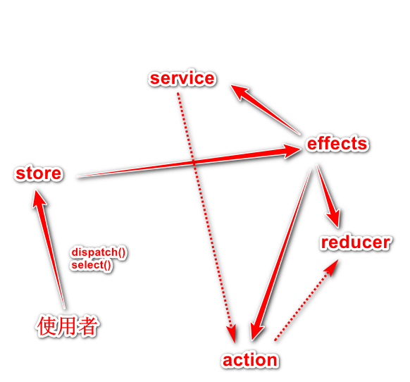

# redux


## 用一句话概述
状态指的是影响到ui变化的数据，使用store维护的状态具有全局、唯一、每次都会返回新的状态的特点。
redux 一般在coremodule中引入  
好处：   
（1）不会直接操作状态，避免多人协作造成的混乱    
（2）把对内存数据的修改，从组件中剥离开  
  

Effect角色是对reducer的补充，
reducer用来专门处理内部的状态的变化，effects用来处理外部的变化（泛指UI相关，状态之外的变化），比如http请求，dom操作等等。并且使使用者可以直接和store$流对话，不在关系其他的角色是如何处理的。
  
  

## 原理
reducer 
- 初始状态 
```
 const initialState State = {
     quota: {
         id: 1
         name: "zhangsan"
         params: "zs"
     };
 }
```
- 每一个状态
```
 export ingerface State{
     quota:{
         id:
         name:
         params:
     };
 }
```
action（举个例子，有三个动作：发送http请求，http成功返回，http返回失败）
- type
- payload 
store
- index.ts中描述各个reducer
```
    export interface State = {
        quote: Quote.state
    }
    const initialState: State = {
        quote: Quote.initialState
    }
    const reducers = {
        quote: Quote.reducer
    }
    const productionReducers = combineReducers(reducers);
    ……
    storeModule.provideStore(reducer),
    RouterStoreModule.connnectRouter(),
```
- 调用
```
 quote$: Observable<Quote>;
 <!-- 得到最新的状态 -->
 this.quote$ = this.store$.select(state => state.quote.quote);
 this.quoteService$.getQuote().subscribe(
     q=> {
         <!-- 传递消息 -->
         this.store$.dipatch({type:actions.SUCCESS, payload: q})
     }
 )
```

- effects的实现
```
    <!-- 通过ofType筛选捕捉LOAD的action，在得到之后要做一些操作 -->
    <!-- ofType的作用是筛选什么样的操作符 -->
    quote$: observable<Action> = this.action$.ofType(action.LOAD)
    .map(toPayLoad)

    <!-- 原来的调用部分改造成 只负责发出消息和获取结果-->
    this.quote$ = this.store.select(getQuote);
    this.$store.dispatch(new actions.LoadActio(null));
```
## 实现

## 使用

## 引申
reselect软件包，使用缓存记录状态
