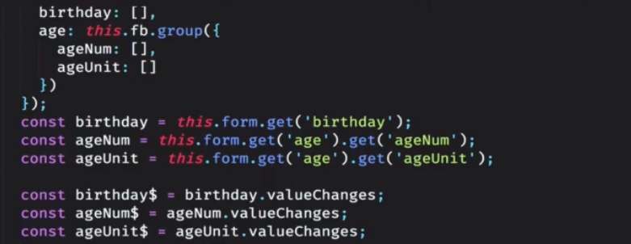

# 模板驱动型表单和响应型表单

## 用一句话概述
- 模板驱动型表单（包括表单验证，FormsModule）  
方便的进行数据的双向绑定，所有的验证都是在模板中完成    
优势：直观简单，容易实现  
劣势：不适应复杂的逻辑，验证逻辑单一  

```
<!-- 为表单添加一个引用 -->
<!-- 通过ngSubmit监听表单的提交 -->
<form #f=ngForm (ngSubmit)="obSubmit(f,$event)">
    <!-- 在表单中使用控件，必须加上"name"属性 -->
    <!-- 添加验证器required -->
    <input name="region" required></input>
    <button type="submit"></button>
</form>
<div>
    <!-- 通过引用获取属性值 -->
    表单数据：{{f.value | json}}
    表单验证状态：{{f.valid | json}}
</div>
```

- 响应型表单（验证器的定义与指定，ReactiveFromsModule）  
formControl <- formGroup  <- formBuilder  
同步验证器，异步验证器（后台验证，如用户名重名）
```
<!-- 响应式表单加在一个group中 -->
<form [formGroup] ="form" (ngSubmit)="onSubmit()">
    <!-- 每一个控件需要加上formControlName -->
    <input formControlName="email"></input>
     <input formControlName="password"></input>
     <mat-error>{{form.control.email.error | json}}</a>
</form>
```
```
 export Class loginComponent{
     form:FormGroup
     constructor(private fb:FormBuilder){

     }
     ngOnInit(){
         <!-- 初始化表单 -->
         this.form = new FormGroup({
             <!-- 逐一初始化表单控件，并给初始值，其实还是value，validate两个关键字 -->
             email: new FromControl("123@neusoft.com",Validators.compose([Validators.required,Validators.email])),
             password: new FromControl("",Validators.required),
         })
     }
 }

```
使用FormBuilder简化版本
```
 export Class loginComponent{
     form:FormGroup
     constructor(private fb:FormBuilder){

     }
     ngOnInit(){
         <!-- 初始化表单 -->
         this.form = this.fb.group({
             <!-- 逐一初始化表单控件，并给初始值，其实还是value，validate两个关键字 -->
             email: ["123@neusoft.com",Validators.compose([Validators.required,Validators.email])],
             password: ["",[Validators.required]],
         })
     }
     onSubmit({value,valid},ev:Event){
         this.form.control["email"].setValidator(this.customValidate)
     }
<!-- 自定义验证器，验证出错的时候返回对象，其他时候返回null -->
    customValidate(c: FormContorl):{[key:string]:any}{
        if(!c.value){
            return null;
        } else {
            return {
                emailNotValie: "email illegal"
            }
        }
    }
 }

```

## 原理

## 实现

## 使用

## 引申
- 监听回车事件
@HostListener("keyup.enter)
sendSubmit(ev:event){

}

