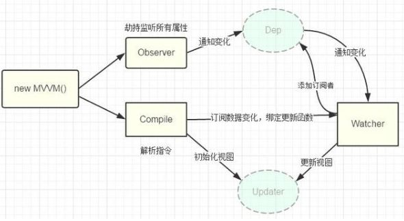

# MVVM

## 用一句话概述
模型-视图-视图模型，视图模型是桥梁，  
通过数据绑定将'模型'转化成'视图'，  
通过DOM事件监听将'视图'转化成'模型'，  
实现了上述两个环节的称之为双向绑定，  

## 原理
MVVM模式：关注Model的变化，让MVVM框架去自动更新DOM的状态，从而把开发者从DOM更新中解脱出来，并可以使用户的操作反应到model上，减少对于dom事件的操作。

## 实现
vm是一整套机制：不同框架对于vm的实现有所不同（双向数据绑定）：
- angularjs
在每一个scope下，都有一个watcher负责watch队列  
当我们每次绑定到UI上的时候就自动创建一个$watch，并把它放到 $watchers  
当触发脏检查的事件发生时，digest就会循环遍历watch，此过程不断循环直到所有的watch都没有变化，之后送到view中渲染。

事件触发 -> $apply -> $digest -> 循环$watch队列检查变化（使用$watch添加监听对象）-> 通知dom发生变化
- vue
vueObserver 数据监听器，把一个普通的 JavaScript 对象传给 Vue 实例的 data 选项，Vue 将遍历此对象所有的属性，并使用Object.defineProperty()方法重新定义属性的setter、getter方法。当data中的某个属性被访问时，则会调用getter方法，当data中的属性被改变时，则会调用setter方法。

Compile指令解析器，它的作用对每个元素节点的指令进行解析，替换模板数据，并绑定对应的更新函数，初始化相应的订阅。Watcher 订阅者，作为连接 Observer 和 Compile 的桥梁，能够订阅并收到每个属性变动的通知，执行指令绑定的相应回调函数。Dep 消息订阅器，内部维护了一个数组，用来收集订阅者（Watcher），数据变动触发notify 函数，再调用订阅者的 update 方法。执行流程如下：

- angular
使用Zone.js 替代 $apply和$digest，用angular树代替watcher队列。用组件树、单方向进行的思想代替，性能比angularjs提高了很多，因为不会重复的检查多次。而且提供了多种脏检查策略：markforcheck、detach等等。并且最关键的是可以在rxjs流中订阅。
## 使用

## 引申
