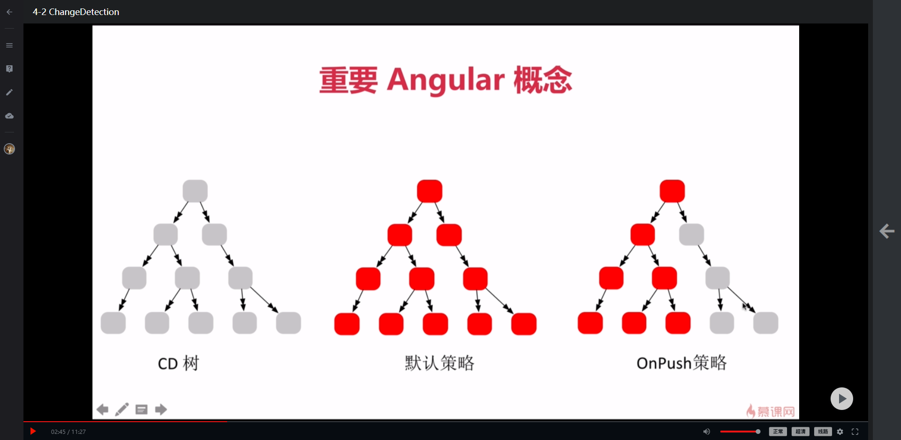

# 标题

## 用一句话概述
- 由异步的事件（Event、XHR、Timer）触发，通过ApplicationRef监听NgZone的onTurnDone，然后执行监测
## 原理
- 截肢，以避免把整个树跑一遍，避免频繁触发带来的性能问题

## 实现

## 使用
- 使用onPush策略，在元数据中加入
changeDetection:changeDectectionStrategy.onPush

- 通知变化已经发生，需要检查
cd: ChangeDectorRef
this.cd.markForCheck()

笨组件完全可以使用onPush策略

## 引申
