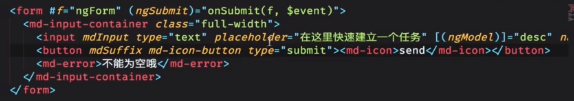
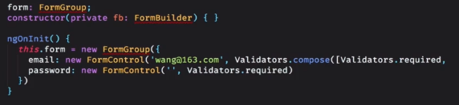
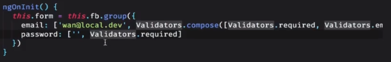
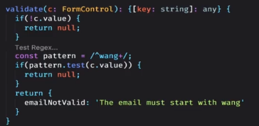

# 标题

## 用一句话概述
- 模板驱动型表单(简单直观的表单)  
-- 双向数据绑定
- 响应式表单  
-- formcontrol <- formgroup  <- formbuilder
-- 自定义验证器
- 可复用的表单

## 原理

## 实现

## 使用
- FormsModule | 模板式表单  
  
- ReactiveFormsModule | 响应式表单  
  
  
- 自定义validator  
  
- 表单控件组件
import ControlValueAccessor 并实现此接口
实现三个方法：（1）writeValue （2）registerOnChange （3）registerOnTouched
## 引申
@HostListener("keyup.enter")