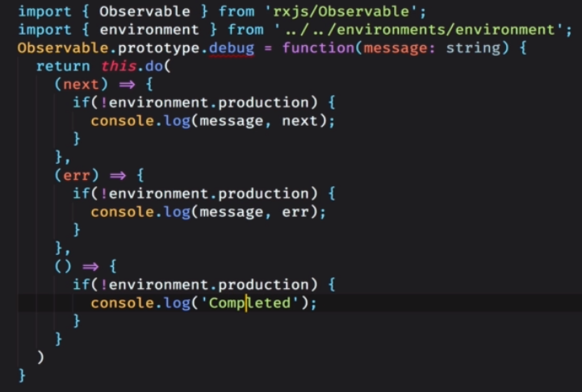
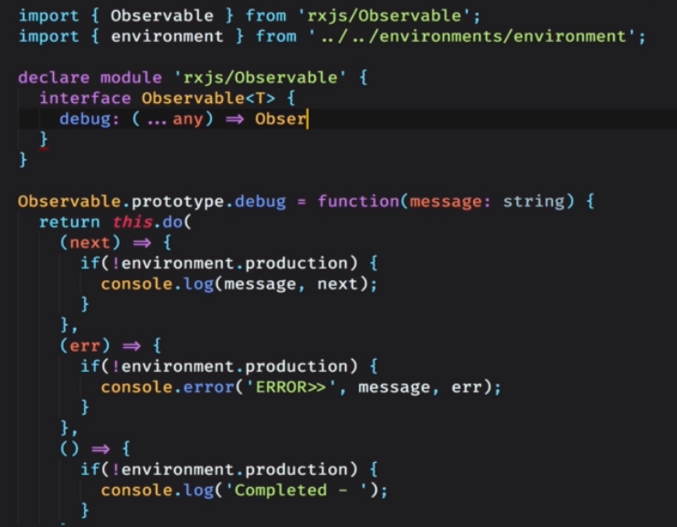
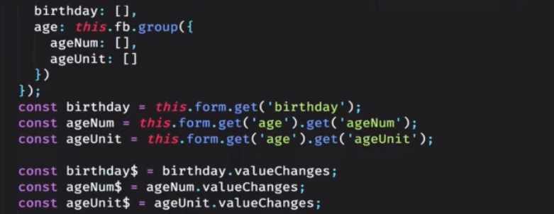

# 标题

## 用一句话概述
- 响应式扩展，优势是在思考维度上加入了时间的考量，把任何变化都要理解想象成一个流，流中涵盖着变化；
- 流被订阅之后，就不需要再次捕捉变化，流会将变化主动推送；
## 原理
- 生成一个流
const height$ = Rx.observabel.formEvent(height, 'keyup')
- 订阅一个事件
height$.subscribe(val => console.long(val))
## 实现
  
  
## 使用

## 引申
- 创建类操作符  from（数组） 、 fromEvent、of（针对对象转换成流）

- map 、mapTo、 pluck（用于取对象某个键上的值）
- combinelatest 两个流进行合并，并且只要有一个流发生变化，就重新计算；
- zip 两个流合并，并且要两个流都发生改变的情况下重新计算，适用于两个值是相互依赖的；
- 
- debounce、debounceTime（300）节流，300毫秒内的输入不触发变化
- destinct（没有重复元素）、distinctUntilChanged（不与前一个相同即可，适用于无尽序列）
- merge、concat（合并到末尾，不适合无尽序列）、startWith（队首插一个值，一般用于默认值）流的合并
- combineLatest、withLatestFrom（分为一个主流，一个辅助流，当主流发生变化，去取辅助流的最新数据）、zip（两个都得是最新的变化，才会生效）

- 表单控件里的valueChanges
  
- 流中有流的处理： FlatMap（mergeMap）、switchmap（在发生变化时，会断掉之前的流，产生一个  新流）
- take(1) 相当于在监听一次变化后取消订阅