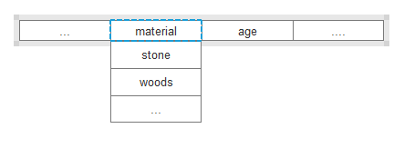
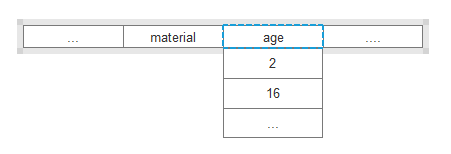

# geojson格式与交互设计

## 概述

geojson格式如下：

```
{
  "type": "FeatureCollection",
  "features": [
        {"type":"Feature",
        "properties":{},
        "geometry":{
            "type":"Point",
            "coordinates":[105.380859375,31.57853542647338]
            }
        },
        {"type":"Feature",
        "properties":{},
        "geometry":{
            "type":"Point",
            "coordinates":[105.380859375,31.57853542647338]
            }
        }
    ]
}
```
feature属性中的geometry的书写格式有统一的标准，官方文档已经标注的比较清晰，不再赘述。需要强调的是properties的书写格式。
* 附：geometry的格式链接： https://www.jianshu.com/p/852d7ad081b3

## 属性
系统默认支持属性
- name: feature的名字 
- color：feature的颜色
feature携带的属性：例如材料为石材，年限为15年
- material: "stone"
- age: 15

dataviz会归纳所有feature，属于同一属性名（feature携带的属性，不包括系统默认属性）将归纳为一个下拉框选项：  
例如：  
```
   {"type":"Feature",
        "properties":{
            "name":"公寓1号",
            "color":"blue",
            "material": "stone",
            "age":"15",
        },
        "geometry":{
            "type":"Point",
            "coordinates":[105.380859375,31.57853542647338],
            }
        }
    }，
     {"type":"Feature",
        "properties":{
            "name":"公寓2号",
            "color":"red",
            "material":"woods",
            "making": {"material":"marble"},
            "age":"2",
        },
        "geometry":{
            "type":"Point",
            "coordinates":[105.380859375,31.57853542647338],
            }
        }
    }
```
将生成菜单项如下（菜单项是有checkbox的，axure没画出来）：




### 节点的关联关系
如果属性之间存在依赖关系（ 上下级），例如making属性依赖material属性，material属于石材，making属于大理石，可以如下定义：
- "material": "stone",
- "making": {"material":"marble", "dep":"stone"}


## 交互设计

### 界面生成逻辑
### 存储geojson格式
## 扩展

### geojson的读取为后台读取

### geojson文件的存储为压缩存储

### 支持用户拓展筛选组件
上传一张图片作为背景图
