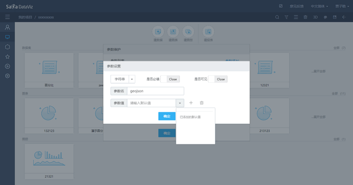

# geojson的feature的交互设计
## 效果图

## 整体流程

## 参数的设置流程
### 参数的生成
当前，添加参数的入口如图1所示，是一个纯手动的过程。  
geojson的参数应该与此不同，由上传geojson文件后系统自动生成，并初始化属性名，UI类型以及参数选项，并且支持二次修改，如图3。  
用户可以直接拖拽到条件区域使用，最终效果应如图4所示的树形结构。

   

图1  
   

图3  
   

图4  
### 初始参数名和选项的生成
遍历geojson文件中features对象的properties下辖属性得到。举一个复杂的例子，如下所示：  

   

迭代后将生成界面如图5：  

   

图5  
选项列表中如图6：  

     
图6  
### 参数、联动条件与geojson属性的映射

由geojson生成的参数支持在联动页面进行配置。
逻辑描述：当选择被联动的图表为gis类型的图表，会检测该图表是否上传了geojson文件，如果有，则与字段一并列出，效果如图7所示：  

    
图7

## geojson文件的存储

- 如果是单文件的形式，将资源地址写在图表属性中，geojson文件需另存储在服务器的系统文件中，可以随项目导出；
- 如果是rest接口的形式，则将资源地址写在图表属性中即可；

## feature的过滤

feature的过滤分为两种：
- 按照 conditions 和 params 条件共同过滤，将结果返回后存放到dv_geojson_temp中；
- 在显示时，按照视野的变化，实时在dv_geojson_temp中取数据；

## 图表的联动与参数过滤

- 当参数和联动条件共同作用下，需要将参数和过滤条件整合到一起
- 参数目前能表示"或"的查询吗？？？？

## 其他的关键点

- 需要在后台实现判断feature是否在当前视野的经纬度范围内的比较功能； 
