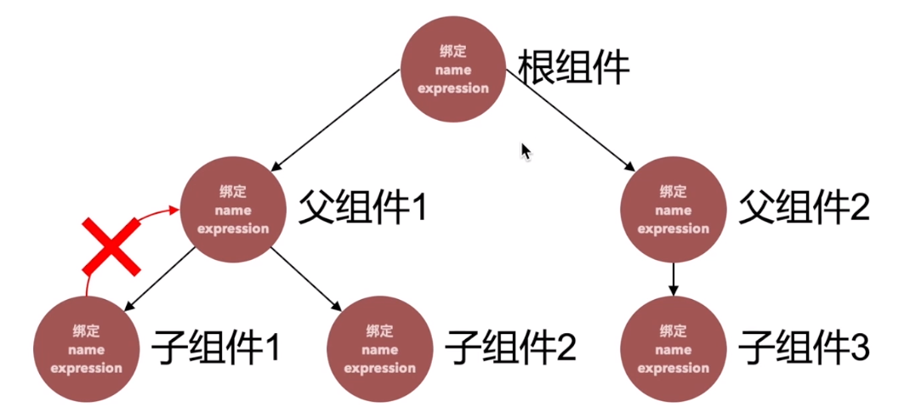
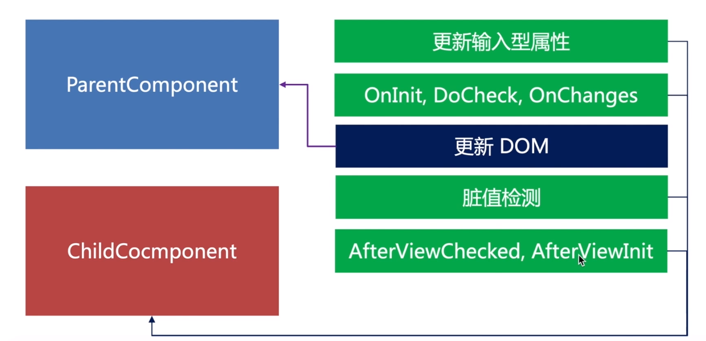

# 标题

## 用一句话概述
当数据模型Model改变的时候更新视图  
触发脏值检测： 事件、setTimeOut、http请求  
机制是什么样的？  
针对这样的一个视图对象，angular会建立一个字典对象：
  

{{textContent1}}

……
{
    name:'textContent',
    expression: title
},
{
    name: textConent_1,
    expression: textContent_1
}
……
最终形成的单向树状结构：
  
  
先进行一次整棵树的脏值检测，然后马上检测值是否发生了变化，同时在编程中不要把值的变化卸载afterviewchecked和afterviewinit两个方法中，会触发死循环
优化的方式:
（1）组件使用onpush策略（组件会只观察input的内容变化，并且只跑此分支的树形结构）    
（2）子组件的输入和状态的改变完全依赖父组件，自己变成一个笨组件，完全听父组件的命令，仅负责页面的展示  
angular框架通过自身的checkandupdateview、checkandupdateBinding方法，逐一进行组件的检测  
（3）如果input没有发生变化，通过markforcheck通知脏值检测

## 原理

## 实现

## 使用
ngzone获取到浏览器运行angular的js运行池，将值放在ngzone之外并且使用异步的操作，即可绕过脏值检测runoutsideangular()
## 引申

