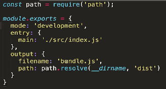

# webpack4.0
https://webpack.docschina.org/
## 优势

- 根模块只引入index.js即可
- index.js通过import的方式，使文件之间的依赖关系更加的明确
- 使文件加载顺序不相互依赖

## 定义

    webpack实质上是 module bundler，只认识模块中的关键字，如import和export
## webpack.cli

- npx webpack index.js
- 用webpack打包时，需要将模块export出去，才能import进来

## 模块化

- ES module（import和export）
- CommonJS （require('./XXX.js')和 modules.exports = XXX）
- CMD 和 AMD

## 如何提高打包速度

- 提高node和webpack的版本

## webpack安装
- 全局安装 npm i(uninstall) webpack webpack-cli -g
- 项目内安装 npm i webpack webpack-cli --save-dev (-D)，此时命令变成 npx webpack -v
- 安装流程 
（1）npm init  
（2）npm install webpack@xxx -D
（3）npx webpack -v
## webpack的打包
- webpack （使用全局安装的webpack打包）
- npx webpack --config 指定配置文件名
- npm run bundle (package.json文件中的scripts)

