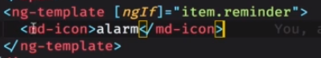

# 标题

## 用一句话概述
- 结构型：ngFor  
- 属性型：ngClass
## 原理
- ngif的原理
传入表达式，当表达式为true的时候，用viewContainer.createEmbedderView插入子节点
否则，执行viewContainer.clear删除自身
## 实现

## 使用
- 属性型指令

- 结构型指令
*代表外面套着ng-template，是一种语法糖

## 引申
- ngModule 是一些具有独立功能的文件集合
- 模块的元数据，entryComponents是指已进入就需要生成的模块，比如对话框等
- forRoot，本身是一种静态方法，可用于动态生成元数据中的内容，在不同的情况（移动端）有不同的加载策略
- ngClass ngStyle [class.yourClassName]三种指定样式的方法