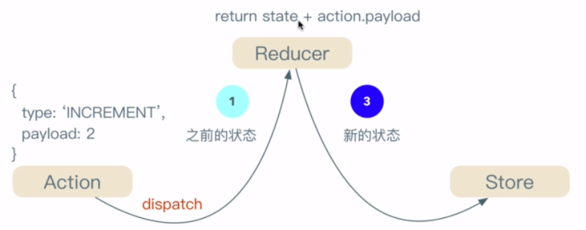

# 标题

## 用一句话概述
- 状态管理机制，状态就是影响到ui变化的数据。解决碎片化的状态
- 全局的、唯一的、不可改变的内存状态
## 原理
angular中的rxjx状态管理一共有三种模式： store模式、effect模式、entity模式 

- 一共3个文件reducers（包含state、initialState状态和一个reducer纯函数）和actions（定义actions的type、定义几个常量），以及用来dispatch  actions的状态的component
- store 
- action   
- reducer

## 实现

## 使用

## 引申
- 添加强类型约束
- 在缓存中查找状态，以提高性能 createFeatureSelector() 和 createSelector() ，这两个方法合起来使用，可以看作是一种性能优化机制，目的是缓存已经变更过的状态。如此，在 article.component.ts 中可以直接通过 this.store.select() 方法，调用 article.reducer.ts 中的 getArticles() 来获得缓存中的state。

- 添加一个全局的入口，维护所有的reducers和states
